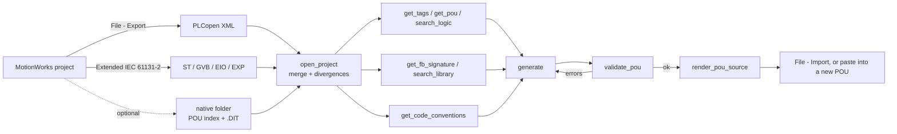

# motionworks-iec-mcp-server

> MCP server for Yaskawa MotionWorks IEC 3 — parse project exports and give AI agents structured access to POUs, variables, data types, tasks, I/O and motion configuration.

[](LICENSE)
[](https://www.python.org/downloads/)
[](https://modelcontextprotocol.io/)

MotionWorks IEC has no AI tooling. Every other IEC 61131-3 environment has at least
an export story an agent can read; MotionWorks stores its code in a proprietary
compound binary (`src.st1`) and leaves you to read it in the IDE. This server
closes that gap by parsing the formats MotionWorks *does* export — and, because no
export defines the firmware motion library, by extracting that library's own
reference documentation from the MotionWorks installation.

## What This Does

Connects AI agents (Claude, GPT, local LLMs) to a MotionWorks IEC project via the
[MCP Protocol](https://modelcontextprotocol.io/). It reads three export forms and
merges them:

| Source | What it is | Best for |
|---|---|---|
| **PLCopen XML export** (`<Project>.xml`) | Standard IEC 61131-10 / TC6 export | Everything — all POUs, **all** languages, tasks, enumerated types |
| **Extended IEC 61131-2 export** (`<Project>/`) | Plain-text projection, one file per POU | Structured Text, `AT %` addresses, **task names**, I/O configuration |
| **Native project** (`<Project>.mwt` + folders) | What the IDE itself works with | The authoritative POU/task/dependency map, and `.DIT` function-block interfaces |
| **Firmware library reference** | The vendor's own help, installed with MotionWorks | What the motion blocks *are* — see below |

Plus the reference documentation for the firmware library, which is the difference
between code that compiles and code that only looks plausible.

The three exports are **complementary, not redundant**, and each is incomplete in a
different way. Rather than pretend otherwise, the server merges them and reports
every disagreement via `get_sources`, so you can see when an export is stale or
partial. Concretely, in the sample projects shipped with this repo:

* `TopCutter.xml` **omits** `TopCutterCutControl`, `TopCutterCamSetup` and
  `TopCutterFFCamSetup`, which the Extended export has.
* `StraightCut` appears **only** in the XML.
* `TopCutter.xml` ships an **empty** `<ST>` body for `StraightCut`, `CamGen` and
  `Initialize`; the Extended export has their real source.
* The native project declares 10 programs and 5 function blocks the exports do
  not all mention.
* For `MC_Direction` the export lists five values and the vendor help documents
  four — `Both` is accepted by the firmware but undocumented in that help version.

### The firmware library reference

No MotionWorks export defines `MC_Power`. The XML references it by name and never
says what it takes. So the agent cannot know that it has ten parameters, which
three of them do nothing on this firmware, or what `BufferMode` accepts.

The reference exists on disk. MotionWorks installs each library's documentation as
compiled help, and Windows can decompile it:

```
C:\ProgramData\Yaskawa\MotionWorks IEC 3 Pro\<version>\plc\FW_LIB\<lib>\*.chm
hh.exe -decompile <dir> <chm>          # driven via PowerShell Start-Process
```

The server does this lazily, once, into a local cache, and parses the pages into a
structured catalog. Against the installed 3.7.5.1 reference that is **110 function
blocks**, **41 data types** and **45 enumerated values** — parameter names, scopes,
data types, defaults, per-parameter descriptions, unimplemented-pin flags, block
purpose, notes, related blocks and usage examples.

Nothing of Yaskawa's is copied into this repository: the extraction goes to
`%LOCALAPPDATA%\motionworks-iec-mcp\fwlib\` and the vendor content stays where
Yaskawa installed it. Cold extraction plus parse takes about 1.4 s; afterwards it
is ~10 ms from a cached catalog.

### Smart Chunking

A ladder or FBD body in the XML export is thousands of lines of coordinate
geometry. This server collapses each network to one line naming every block,
instance and formal parameter — the equivalent of NeutralText for Studio 5000:

```
MC_Power(MC_TopCutter_ServoOn) Enable=EIP_FromCLX_Axis_SVON_Cmd Axis=TopCutter
MC_Reset(MC_TopCutter_Reset) Execute=EIP_FromCLX_Axis_FaultReset Axis=TopCutter
MC_ReadStatus(MC_TopCutter_ReadStatus) Enable=Always_True Axis=TopCutter
```

Structured Text is returned as the original source, tab alignment and inline
comments intact.

## Installation

Not on PyPI — install from the repository:

```bash
git clone https://github.com/KphungFROMM/motionworks-iec-mcp-server.git
cd motionworks-iec-mcp-server
python -m venv .venv
.venv/Scripts/python -m pip install -e .
```

`pip install -e ".[dev]"` additionally installs pytest, for running the suite.

Requires Python 3.10+. The firmware library reference additionally needs Windows
with `hh.exe` and PowerShell; without them everything else still works and library
signatures fall back to what the project itself reveals.

## Quick Start

### stdio (local — Claude Desktop, Claude Code, DSH, kiro-cli)

```bash
motionworks-iec-mcp-server
```

### SSE (remote)

```bash
motionworks-iec-mcp-server --transport sse --host 127.0.0.1 --port 8080
```

## Configuration

### Claude Desktop / generic MCP client

```json
{
  "mcpServers": {
    "motionworks": {
      "command": "motionworks-iec-mcp-server",
      "args": []
    }
  }
}
```

### Environment variables

| Variable | Purpose |
|---|---|
| `MOTIONWORKS_FWLIB` | The `FW_LIB` folder, **or** a folder of already-extracted `.htm` pages (the escape hatch for hosts without `hh.exe`). Set but missing is treated as an error rather than silently ignored. |
| `MOTIONWORKS_FWLIB_CACHE` | Where extraction and the parsed catalog are cached. |
| `MOTIONWORKS_SAMPLES` | Only used by the test suite, to point at real exports. |

### Installing into a project-local venv

```bash
python -m venv .venv
.venv/Scripts/python -m pip install -e .
```

Then point the client at `.venv/Scripts/motionworks-iec-mcp-server.exe`.

## Available Tools

### `ping`
Health check. Returns `"pong"`.

### `open_project(path)`
**Start here.** Detects the source form, merges every export present, and returns
the project summary including a `divergences` list. `path` may be a PLCopen XML
file, an Extended export directory, or a native project directory.

### `load_project(plcopen_xml_path)`
Parse a PLCopen XML export specifically. Kept for parity with the studio5000
connector; `open_project` supersedes it.

### `get_sources(path)`
Which export forms exist, what each supplied (POUs with code, languages), what the
counts are, and exactly where the sources disagree. Use this whenever a tool
returns less than you expected.

### `get_tags(path, scope?, data_type?, address?, search?)`
Every variable in the project — global variables with their `AT %` addresses and
comments, plus each POU's declared interface.

```
get_tags(path, data_type="AXIS_REF")
get_tags(path, address="%MX1.7")        # what lives at this bit?
get_tags(path, search="PLCMODE")
```

### `get_tag(path, tag_name)`
One variable: its declaration(s), its type's members, and **every place it is
used** across POUs, networks and lines.

### `get_types(path, search?, kind?, limit?)`
Data types, structs, enums and function blocks. This is the vocabulary code must
be written against — including the Yaskawa motion library (`AXIS_REF`,
`Y_ENGAGE_DATA`, `MC_*`, `Y_*`, `AxisControl`) that only the PLCopen XML export
carries.

### `get_type(path, type_name?, search?)`
A type definition with its members, types and comments.

### `get_udts(path)` / `get_udt(path, udt_name?)`
Project-defined types only, excluding the vendor library.

### `get_fb_signature(path, fb_name)`
A function block's interface, combining two authorities because each knows
something the other does not:

* the **project** knows the exact pin list its firmware build compiled against
  (from `.DIT` metadata) or what the code actually passes;
* the **firmware reference** knows data types, defaults, per-pin meaning, which
  pins this firmware leaves unimplemented, the block's purpose and an example.

Pins the project never mentioned are still listed, so a block can be called with
parameters it has never been called with here. `unsupportedPins` names parameters
that exist but do nothing. A disagreement about a pin's type keeps both, as `type`
and `projectType`.

```
get_fb_signature(path, "MC_MoveAbsolute")
→ 15 pins, e.g.
    inOut  Axis       AXIS_REF        ("Logical axis reference…")
    input  Position   LREAL           default LREAL#0.0
    input  Direction  MC_Direction    default MC_Direction#1
    input  BufferMode MC_BufferMode
    output Done       BOOL
```

### `list_library_blocks(search?, library?, limit?)`
Every function block the firmware provides — device documentation, not project
state, so it works without opening a project and includes blocks the project never
uses. Use it to find out what is available before writing code.

### `search_library(query, limit?)`
Search the reference by block name, formal parameter, type name, description, notes
or example code. Answers "which block do I use for X?".

```
search_library("torque")   → MC_TorqueControl, MC_ReadActualTorque, Y_ControlMode…
search_library("cam")      → Y_CamIn, Y_CamOut, Y_CamScale, Y_CamShift…
```

### `get_library_reference_status()`
Whether the reference is available, which libraries it found, what the cache holds,
and — when it is not available — exactly how to enable it.

### `get_code_conventions(path)`
**Call this before generating code.** Conventions are written down nowhere; they
are visible only in the existing symbols, and code that compiles but breaks them
reads as foreign in review. Each rule carries its evidence and a confidence, so a
weak signal is not mistaken for a house standard.

```
get_code_conventions(path)
→ "x" names boolean variables (BOOL)            [strong, 120 uses]
  "i" names integer variables (INT)             [strong, 44 uses]
  "r" names real variables (LREAL)              [strong, 31 uses]
  function-block instances are prefixed with the block family and purpose
  "EIP_ToCLX_*" is an established signal family (89 variables)
  tasks run in priority order FastTsk(T#4ms), MedTsk(T#20ms)…
  body languages in use: ST×4, LD×3
  namingSummary: {boolean: x, integer: i, real: r}
```

### `get_pous(path, language?, task?, search?)`
Programs and function blocks with language, assigned task and size.

### `get_pou(path, pou_name, offset?, include_interface?, include_outputs?)`
**The workhorse.** One POU's interface, its body, and every network it contains.
Structured Text comes back verbatim; LD/FBD comes back as one text line per
network plus a structured `nets` array. Long bodies page via `offset` and report
`truncated`/`nextOffset`.

```json
{
  "name": "ServoTaskSlow", "language": "LD", "task": "SlowTsk",
  "interface": { "VAR_EXTERNAL": [{"name": "TopCutter", "type": "AXIS_REF",
                                   "comment": "SGD7S - 1 (Do Not Modify!!)"}] },
  "body": { "networkCount": 5, "code": "MC_Power(MC_TopCutter_ServoOn) ...",
            "nets": [{"number": 0, "nodes": [{"kind":"block","type":"MC_Power",
                      "instance":"MC_TopCutter_ServoOn",
                      "params":{"Enable":"EIP_FromCLX_Axis_SVON_Cmd","Axis":"TopCutter"}}]}] }
}
```

### `get_routines(path, program?)` / `get_routine(path, program, routine_name?)`
Aliases for `get_pous` / `get_pou` so the studio5000 calling convention works.

### `get_tasks(path)`
Controller tasks with type, interval, priority, watchdog and the programs each
runs. Task assignment decides execution order — check it before assuming two POUs
run in sequence.

### `get_io_config(path)`
Named I/O groups with address ranges, drivers and data types, which is how the
`AT %I`/`%Q` variables get their physical meaning.

### `get_motion_config(path)`
The motion picture: every axis reference, the `<axis>.AxisNum := N;` bindings
found in startup code, the servo/network groups from the I/O configuration, and
the motion types available. Answers "which servo is axis 1?".

### `search_logic(path, pattern, limit?)`
Where is this symbol used / which routines call this block? Matches the symbol
table (declarations, block types, instances, pins) first, then raw ST lines.
Regex supported — note the pattern is a plain regex, so `MC_` matches every
`MC_*` block reference.

```
search_logic(path, "TopCutter_Homed")
search_logic(path, "MC_")             # every MC_* block reference
search_logic(path, "Y_Cam(In|Out)")   # either cam block
```

### `validate_pou(path, code, declared_vars?, pou_name?)`
**Validate generated code against the project's real symbols.** Catches the
mistakes an LLM actually makes, before the user sees them:

* `undeclared_tag` — a symbol the project does not declare anywhere
* `unknown_type` — a declaration using a type the project does not have
* `unknown_pin` — a formal parameter the target FB does not define
* `duplicate_declaration` — the same variable declared twice in one scope

Identifier comparison is **case-insensitive**, because IEC 61131-3 identifiers are
— the `RK_DemoOnMP3300iec` sample declares `Products` and compiles `products`. A
case-sensitive check would report that legal code as undeclared. A casing
difference from the declaration is surfaced as an `identifier_case` style warning
instead, and `caseVariants` lists them.

Pin names are checked against the project's own block definitions where it has
them, and against the **firmware reference** otherwise — which matters because an
Extended-only project carries no type definitions at all, so without it the pin
check would silently do nothing for exactly the projects that need it.

A native project looks like the real thing and is the most natural path to point at,
but its code is a compound binary. So when a source is missing, `open_project` and
`get_sources` return an **`exportGuidance`** block rather than a hollow result: what is
missing, what it costs, the verified export steps, and — if exports exist elsewhere on
disk — the path to the one matching this project. An agent handed a bare `.mwt` can
therefore tell you what to do instead of guessing at code it cannot see.

| Situation | `issue` | Consequence |
|---|---|---|
| native project only | `no_export_found` | nothing readable — no source, variables or types |
| Extended export only | `plcopen_xml_missing` | no type definitions, so no block interfaces; 16 % graphical pin recovery |
| PLCopen XML only | `extended_iec_missing` | no I/O configuration, task names or `AT %` addresses |

### `render_pou_source(name, pou_type?, language?, declaration?, code?, description?)`
Emit a POU in the shape MotionWorks' **Extended IEC 61131-2 export** uses — the
`(*@PROPERTIES_EX@ ... *)` header, the `PROGRAM`/`FUNCTION_BLOCK` line, declaration
blocks and the `(*@KEY@: WORKSHEET ... *)` body region.

This output parses back through this server, so its structure matches the export
format. Whether the **IDE imports** that shape is *not* verified — that format is
undocumented in the installed help, whose documented import path is PLCopen XML
(`File` → `Import`). So either create a POU in the IDE and paste the code, or wrap
the result in PLCopen XML for the documented route. See
[WORKFLOW.md §5](WORKFLOW.md#5-getting-the-code-back-into-the-project).

### `render_type_source(name, members?, comment?)`
Emit a `TYPE ... END_STRUCT END_TYPE` definition in the same shape, with the same
caveat about import.

### `list_languages()`
Which IEC body languages are rendered, from which source, and how completely.

## Workflow

**[WORKFLOW.md](WORKFLOW.md)** is the end-to-end guide: install, the exact IDE export
steps (quoted from MotionWorks' own help), which artifacts to point at, example
prompts, and how generated code gets back into the project.

The short version:

1. **Install** the server and add it to your MCP client.
2. **Export from MotionWorks** — `File` → `Export` → "Export PLCopen xml file", saved
   as **V1.01**. The XML export deliberately excludes I/O configuration (the vendor
   help says so), so also produce the Extended IEC 61131-2 export.
3. **Point the agent at one project's artifacts.** It merges them and reports where
   they disagree — read that list, it is often the most important thing about a
   project.
4. **Work in the loop**: ask → the agent looks up real symbols, conventions and block
   signatures → generates → validates against the project → emits a file.
5. **Get it back in** by pasting into a new POU, or via `File` → `Import` →
   "Import PLCopen xml file" (the documented path).



### Example conversation

```
You: Open the TopCutter project and tell me what it does.

Agent calls: open_project("C:/projects/PLCOpen XML Export/TopCutter.xml")
             open_project("C:/projects/Extended IEC 61131-2 Export/TopCutter")

Agent: Both merged — 10 POUs, 281 variables, 7 tasks, processor MP2600iec.
Divergence warnings: the XML export omits TopCutterCutControl, TopCutterCamSetup
and TopCutterFFCamSetup, while it is the only source for StraightCut, CamGen and
Initialize — and it ships an empty body for two POUs the Extended export has real
source for, which is what I used. Named tasks are FastTsk (T#4ms, priority 0),
MedTsk (T#20ms, 3), SlowTsk (T#100ms, 7), plus BG and Start with no interval.
CamGen and Initialize run in tasks the named export does not describe — priority 10
/ 1 s and priority 0 / WarmStart — so those are reported by schedule instead of name.

You: What drives TopCutter_Homed and who reads it?

Agent calls: get_tag(project, "TopCutter_Homed")

Agent: A global BOOL, "Top Cutter Axis is Homed". Written in ServoHoming (LD) and
read in four places: TopCutterCutControl (ST), EIP_ToCLX (LD, feeding
EIP_ToCLX_Axis_Homed) and ServoTaskSlow. Gated on PLCMODE_RUN.

You: Add a POU that reads the top cutter position and scales it.

Agent calls: get_code_conventions(project)
             get_fb_signature(project, "MC_ReadActualPosition")
             validate_pou(project, "<generated code>")

Agent: This project uses x/i/r prefixes and MC_<Thing>_<Action> instance names, so
I named things accordingly. MC_ReadActualPosition takes Axis (AXIS_REF),
Enable (BOOL), Valid/Busy/Error (BOOL), ErrorID (UINT), Position (LREAL).
Validated against the project: 0 errors. Here's TopCutterPosition.ST.
```

Every claim there comes from a tool result rather than the agent's recollection,
which is the point. See [WORKFLOW.md](WORKFLOW.md) for the full worked example.

## Design Constraints Worth Knowing

* **Graphical logic is authoritative in the PLCopen XML export.** The same logic
  recovered from an Extended export's `.GE` file is partial by design: the format
  is undocumented, and the ordinal/pin mapping that would recover it fully does not
  round-trip reliably. So the `.GE` decoder reports block structure, pins and
  parameter names exactly (verified against the XML for the same programs) and
  recovers pin *values* only where it is provably safe — currently 100 % precise,
  16 % recall on the sample set, with the unmatched count reported rather than
  guessed. `list_languages` states this at runtime.
* **Merged projects pick the body per language, not per file.** Structured Text
  comes from the plain-text Extended export (original tab alignment); LD/FBD comes
  from the PLCopen XML (real connections, complete pin values). Which export a body
  came from is reported as `body.source`, separately from the POU's own `source`
  which names the record that supplied its metadata.
* **Task merging is exact, and refuses to guess.** The PLCopen XML export carries no
  task names, so its tasks arrive as `task@<priority>@<interval>` and are matched to
  named tasks by **priority and normalised interval** — the two exports write
  intervals differently (`00:00:00.20` and `T#20ms` are both 20 ms, and the first is
  *not* a decimal fraction of a second). Matching on any overlap of program lists was
  tried and removed: when two exports describe different generations of a project, a
  partial overlap silently welds programs onto the wrong task. A program-list
  disagreement is reported as `task_program_conflict` and the named export wins;
  a task that cannot be matched keeps its provisional `@` name, because a known
  schedule with an unknown name is more useful than a guess.
* **The native project cannot supply code.** `src.st1`, `TREE.XML` and `.IOC` are
  compound binary. What it does provide is the authoritative POU/task/dependency
  map from `eCLRPouDependencies.dat`, plus the `.DIT` function-block interfaces
  described above.
* **No live controller connection.** MotionWorks IEC exposes no documented
  programmatic interface, so this server is export-based, like the studio5000
  connector. Re-export from the IDE to refresh.
* **Read and generate, not write-back.** Generated code is emitted to a file for
  import. This server will not write into a `.mwt` project: the format is
  undocumented binary, and a bad write could corrupt a live machine project.

## Known Gaps

Stated plainly, because the difference between "plausible code" and "code that
compiles" lives here.

1. **Graphical wiring recovered from a `.GE`-only project is partial.** If the
   PLCopen XML export is unavailable, the `.GE` decoder reports block structure,
   pin names and parameter names exactly but recovers only 16 % of pin *values*
   (100 % precise — it never reports a wrong one). Re-export as PLCopen XML when
   you can.
2. **The reference documents one firmware version.** The catalog is keyed to the
   installed MotionWorks version. Values and support flags differ between versions,
   so a project built against a different firmware release may see pins marked
   supported here that are not, or vice versa. `get_library_reference_status`
   reports which version was read.
3. **Project-generated `.DIT` interfaces can disagree with the reference** about a
   pin's underlying type (the export records `INT` where the block declares
   `MC_BufferMode`). Both are reported rather than one being discarded, but the
   reference is preferred for the declared type.
4. **No write-back into the IDE, and the import path for generated text is unverified.**
   `render_pou_source` emits the shape the Extended IEC 61131-2 *export* uses, which
   this server parses back — but whether the IDE **imports** that shape is not
   documented in the installed help, whose documented import path is PLCopen XML.
   Until a PLCopen XML emitter exists, use `File` → `Import` → "Import PLCopen xml
   file" with your own wrapper, or create a POU in the IDE and paste the code
   (always works). Writing into a `.mwt` is deliberately not attempted: it is
   undocumented binary and a bad write could corrupt a live machine project.
5. **No live controller connection.** MotionWorks IEC exposes no documented
   programmatic interface, so this server is export-based, like the studio5000
   connector. Re-export from the IDE to refresh.

## Project Structure

```
src/motionworks_iec_mcp_server/
├── __main__.py            # CLI entry point (stdio / SSE)
├── server.py              # FastMCP app — 28 tool definitions
├── project.py             # source detection, merge, divergence reporting
├── model.py               # the normalized project model
├── fwlib.py               # firmware library reference: extract, parse, cache, merge
├── cache.py               # mtime-keyed parse cache
├── util.py                # tolerant file reading, IEC text handling
├── codegen/
│   ├── validate.py        # code validation + MotionWorks file emission
│   └── conventions.py     # observed house conventions
└── parsers/
    ├── plcopen_xml.py     # authoritative: POUs, types, tasks, all languages
    ├── extended_iec.py    # text POUs, global vars, I/O config, task names
    ├── native.py          # NODES.LST, POU index, .DIT + TYLLIST interfaces
    ├── graphical.py       # .GE decoder + PLCopen LD/FBD renderer
    ├── st.py              # declaration blocks, POU headers, ST splitting
    └── xref.py            # symbol → usage index

tests/                     # pytest suite (283 tests)
WORKFLOW.md                # install → export → work → import, end to end
FORMATS.md                 # the formats, documented from real files
```

## Development

```bash
python -m venv .venv
.venv/Scripts/python -m pip install -e ".[dev]"
.venv/Scripts/python -m pytest tests/ -v
```

Tests are hermetic by default. Integration tests additionally run against real
exports when `MOTIONWORKS_SAMPLES` points at a folder containing them, and tests
for the shipped reference pages run against a synthetic tree shaped like the real
one — with a further set that runs against the actual installation when present:

```bash
MOTIONWORKS_SAMPLES="C:/Users/me/Desktop/MotionWorks IEC MCP" \
  .venv/Scripts/python -m pytest tests/ -v
```

### Dependencies

`fastmcp` is the **only** runtime dependency; every parser uses the standard library
(`xml.etree.ElementTree`, `re`, `json`, `dataclasses`). That is deliberate — this
runs next to industrial machinery, and fewer moving parts is better. The claim is
enforced by `tests/test_dependencies.py`, which walks the AST of every module under
`src/` and fails if a third-party import appears that `pyproject.toml` does not
declare.

## Roadmap

### v0.1 — Parsing and comprehension ✅
- [x] PLCopen XML parser: POUs, all languages, tasks, globals, enumerated types
- [x] Extended IEC parser: ST/GE/IEC, GVB with addresses, EIO, EXP task config
- [x] Native parser: project tree, POU/task dependency index, `.DIT` interfaces
- [x] Source detection, merge and divergence reporting
- [x] LD/FBD rendering to per-network text (XML full, `.GE` partial by design)
- [x] Cross-reference index and search
- [x] Code validation against project symbols
- [x] MotionWorks file emission for import (POU and TYPE)

### v0.2 — Complete library knowledge ✅
- [x] Firmware library reference: locate, decompile, parse, cache
- [x] 110 function blocks with pin scope, type, default, description and support flags
- [x] 41 data types and 45 enumerated values from the vendor's own help
- [x] Merge reference with project `.DIT` and observed call sites
- [x] `list_library_blocks`, `search_library`, `get_library_reference_status`
- [x] Observed-convention analysis (`get_code_conventions`)

### v0.3 — Close the round trip
- [ ] **PLCopen XML emitter** for generated POUs and data types, so output uses the
      import path the vendor actually documents (`File` → `Import` → "Import PLCopen
      xml file") rather than the Extended text shape, which is unverified for import

### v0.4 — Deeper graphical fidelity
- [ ] Complete `.GE` pin-value recovery (needs a documented ordinal contract)
- [ ] SFC bodies, if any export ever emits them
- [ ] Alarm and cam-table extraction from the reference

### v0.5 — Project write-back
- [ ] Write POUs into an Extended export layout
- [ ] Optional `.mwt` write-back once the container format is understood

## License

MIT — see [LICENSE](LICENSE).
